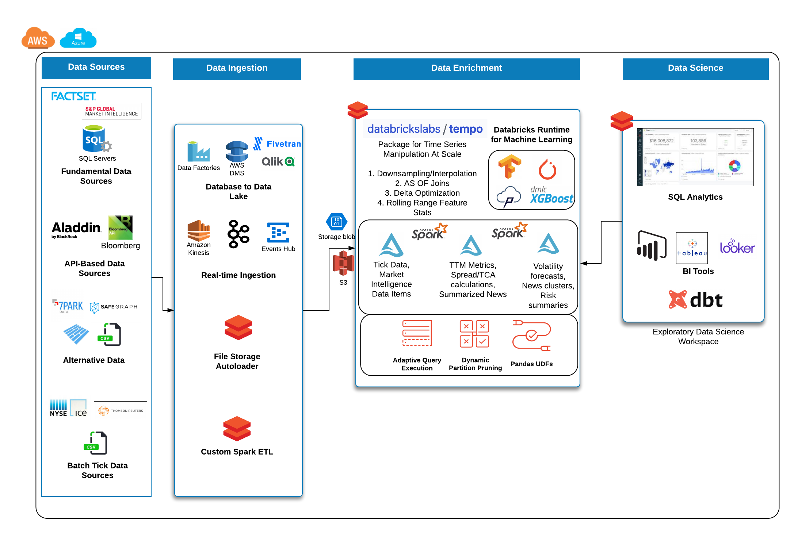

# tempo - Time Series Utilities for Data Teams Using Databricks

<p align="center">
  
</p>


## Project Description
The purpose of this project is to make time series manipulation with Spark simpler. Operations covered under this package include AS OF joins, rolling statistics with user-specified window lengths, featurization of time series using lagged values, and Delta Lake optimization on time and partition fields.

[](https://codecov.io/gh/databrickslabs/tempo)

## Using the Project

Python install in Databricks notebooks using:

```
%pip install -e git+https://github.com/databrickslabs/tempo.git#"egg=tempo&#subdirectory=python"
```

Install locally using: 

```
pip install -e git+https://github.com/databrickslabs/tempo.git#"egg=tempo&#subdirectory=python"
```

Scala installation: 

Once the jar is created (via the following instructions), upload the jar to Databricks for use in a notebook or job:

```
cd scala/tempo
sbt package
```


### Starting Point: TSDF object, a wrapper over a Spark data frame
The entry point into all features for time series analysis in tempo is a TSDF object which wraps the Spark data frame. At a high level, a TSDF contains a data frame which contains many smaller time series, one per partition key. In order to create a TSDF object, a distinguished timestamp column much be provided in order for sorting purposes for public methods. Optionally, a sequence number and partition columns can be provided as the assumptive columns on which to create new features from. Below are the public methods available for TSDF transformation and enrichment.

#### Sample Reference Architecture for Capital Markets

<p align="center">
  
</p>

## Quickstart - Python 

Data source is UCI public accelerometer data available at this URL https://archive.ics.uci.edu/ml/datasets/Heterogeneity+Activity+Recognition

#### 0. Read in Data 

```
from pyspark.sql.functions import * 

phone_accel_df = spark.read.format("csv").option("header", "true").load("dbfs:/home/tempo/Phones_accelerometer").withColumn("event_ts", (col("Arrival_Time").cast("double")/1000).cast("timestamp")).withColumn("x", col("x").cast("double")).withColumn("y", col("y").cast("double")).withColumn("z", col("z").cast("double")).withColumn("event_ts_dbl", col("event_ts").cast("double"))

from tempo import * 

phone_accel_tsdf = TSDF(phone_accel_df, ts_col="event_ts", partition_cols = ["User"])
```

#### 1. Resample and Visualize

###### Sample usage: 
Possible values for frequency include patterns such as 1 minute, 4 hours, 2 days or simply sec, min, day. For the accepted functions to aggreagate data, options are floor, ceil, min, max, mean. Custom functions will be available in a future release.

```
# ts_col = timestamp column on which to sort fact and source table
# partition_cols - columns to use for partitioning the TSDF into more granular time series for windowing and sorting

resampled_sdf = phone_accel_tsdf.resample(freq='min', func='floor')
resampled_pdf = resampled_sdf.df.filter(col('event_ts').cast("date") == "2015-02-23").toPandas()

import plotly.graph_objs as go
import plotly.express as px
import pandas as pd

# Plotly figure 1
fig = px.line(resampled_pdf, x='event_ts', y='z',
              color="User",
              line_group="User", hover_name="User")
fig.update_layout(title='Phone Accelerometer Usage' , showlegend=False)

fig.show()
```

#### 2. AS OF Join 
##### This join uses windowing in order to select the latest record from a source table and merges this onto the base Fact table


<p align="center">
  
</p>


```
from pyspark.sql.functions import * 

watch_accel_df = spark.read.format("csv").option("header", "true").load("dbfs:/home/tempo/Watch_accelerometer").withColumn("event_ts", (col("Arrival_Time").cast("double")/1000).cast("timestamp")).withColumn("x", col("x").cast("double")).withColumn("y", col("y").cast("double")).withColumn("z", col("z").cast("double")).withColumn("event_ts_dbl", col("event_ts").cast("double"))

watch_accel_tsdf = TSDF(watch_accel_df, ts_col="event_ts", partition_cols = ["User"])

# Applying AS OF join to TSDF datasets
joined_df = watch_accel_tsdf.asofJoin(phone_accel_tsdf, right_prefix="phone_accel").df

joined_df.show(10, False)
```

#### 3. Skew Join Optimized AS OF Join

The purpose of the skew optimized as of join is to bucket each set of `partition_cols` to get the latest source record merged onto the fact table

Parameters: 

ts_col = timestamp column for sorting 
partition_cols = partition columns for defining granular time series for windowing and sorting
tsPartitionVal = value to break up each partition into time brackets
fraction = overlap fraction
right_prefix = prefix used for source columns when merged into fact table

```
joined_df = watch_accel_tsdf.asofJoin(phone_accel_tsdf, right_prefix="watch_accel", tsPartitionVal = 10, fraction = 0.1).df
joined_df.show(10, False)
```

#### 4 - Approximate Exponential Moving Average

The approximate exponential moving average uses an approximation of the form `EMA = e * lag(col,0) + e * (1 - e) * lag(col, 1) + e * (1 - e)^2 * lag(col, 2) ` to define a rolling moving average based on exponential decay.

Parameters: 

window = number of lagged values to compute for moving average

```
ema_trades = watch_accel_tsdf.EMA("x", window = 50).df
ema_trades.show(10, False)
```

#### 5 - Simple Moving Average

Method for computing rolling statistics based on the distinguished timestamp column 

Parameters: 

rangeBackWindowSecs = number of seconds to look back

```
moving_avg = watch_accel_tsdf.withRangeStats("y", rangeBackWindowSecs=600).df
moving_avg.select('event_ts', 'x', 'y', 'z', 'mean_y').show(10, False)
``


## Project Support
Please note that all projects in the /databrickslabs github account are provided for your exploration only, and are not formally supported by Databricks with Service Level Agreements (SLAs).  They are provided AS-IS and we do not make any guarantees of any kind.  Please do not submit a support ticket relating to any issues arising from the use of these projects.

Any issues discovered through the use of this project should be filed as GitHub Issues on the Repo.  They will be reviewed as time permits, but there are no formal SLAs for support.

## Project Setup
After cloning the repo, it is highly advised that you create a [virtual environment](https://docs.python.org/3/library/venv.html) to isolate and manage
packages for this project, like so:

`python -m venv <path to project root>/venv`

You can then install the required modules via pip:

`pip install requirements.txt`

## Building the Project
Once in the main project folder, build into a wheel using the following command: 

`python setup.py bdist_wheel`

## Releasing the Project
Instructions for how to release a version of the project
