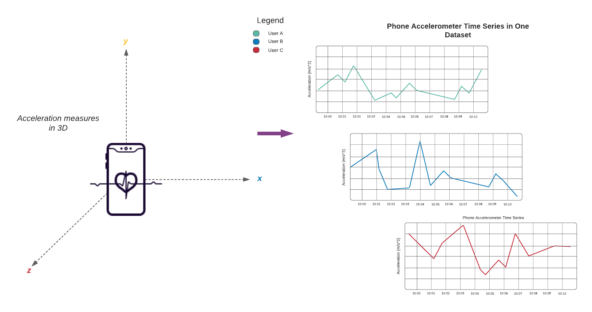
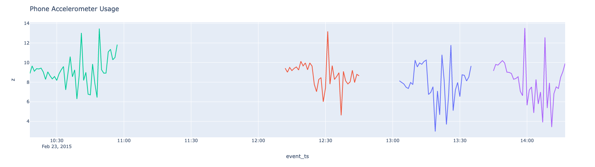

User Guide
==========

Installing
----------

tempo can be installed in ``Python`` with `pip <https://pip.pypa.io>`_

.. code-block:: bash

  $ python -m pip install dbl-tempo

or for ``Scala`` with scala's simple build tool (sbt)

Once the jar is created (via the following instructions), upload the jar to Databricks for use in a notebook or job:

.. code-block:: bash

  $ cd scala/tempo
  $ sbt package

Starting Point: TSDFs
---------------------

The entry point into all features for time series analysis in tempo is a TSDF object which wraps the Spark data frame.
At a high level, a TSDF contains a data frame which contains many smaller time series, one per partition key.
In order to create a TSDF object, a distinguished timestamp column much be provided in order for sorting purposes for
public methods.

Optionally, a sequence number and partition columns can be provided as the assumptive columns on which
to create new features from. Below are the public methods available for TSDF transformation and enrichment.

Sample Reference Architecture for Capital Markets
~~~~~~~~~~~~~~~~~~~~~~~~~~~~~~~~~~~~~~~~~~~~~~~~~

.. image:: _static/ts_in_fs.png
   :alt: Architecture diagram

Quickstart - Python
-------------------

Data source is UCI public accelerometer data available at this `URL <https://archive.ics.uci.edu/ml/datasets/Heterogeneity+Activity+Recognition>`_

Read in Data
~~~~~~~~~~~~

Reading data into a tempo ``tsdf`` is very easy. It provides a simple api to wrap a normal ``Spark`` dataframe with the
time column and the optional partition column specification.

.. code-block:: python

     from pyspark.sql.functions import *
     phone_accel_df = spark.read.format("csv").option("header", "true").load("dbfs:/home/tempo/Phones_accelerometer").withColumn("event_ts", (col("Arrival_Time").cast("double")/1000).cast("timestamp")).withColumn("x", col("x").cast("double")).withColumn("y", col("y").cast("double")).withColumn("z", col("z").cast("double")).withColumn("event_ts_dbl", col("event_ts").cast("double"))
     from tempo import *
     phone_accel_tsdf = TSDF(phone_accel_df, ts_col="event_ts", partition_cols = ["User"])
     display(phone_accel_tsdf)

Slice by Time
~~~~~~~~~~~~~~~~~~~~~~

You can slice across all timeseries in a TSDF in various ways. This allows you to select or filter by timestamp across
all the series.

You can select all observations at a specific point in time:

.. code-block:: python

    target_time = '2015-02-23T13:03:53.919+0000'
    at_target_tsdf = phone_accel_tsdf.at(target_time)
    display(at_target_tsdf)

You can slice data before or after a particular point in time (either inclusive or exclusive of the target time):

.. code-block:: python

    before_tsdf = phone_accel_tsdf.before(target_time)
    at_or_after_tsdf = phone_accel_tsdf.atOrAfter(target_time)

Or in an interval between two timestamps:

.. code-block:: python

    start_ts = '2015-02-23T13:03:53.909+0000'
    end_ts = target_time
    interval_inclusive = phone_accel_tsdf.between(start_ts, end_ts)
    interval_exclusive = phone_accel_tsdf.between(start_ts, end_ts, inclusive=False)

You can take a look at the earliest (oldest) or latest (most recent) records across all series:

.. code-block:: python

    n = 5
    oldest_five_tsdf = phone_accel_tsdf.earliest(n)
    latest_five_tsdf = phone_accel_tsdf.latest(n)

Or the records immediately before (or after) a particular point in time. This can be thought of like an "as-of" select.

.. code-block:: python

    as_of_tsdf = phone_accel_tsdf.priorTo(target_time)
    next_five_tsdf = phone_accel_tsdf.subsequentTo(target_time, n=5)

Resample and Visualize
~~~~~~~~~~~~~~~~~~~~~~

Sample usage
^^^^^^^^^^^^

Possible values for frequency include patterns such as 1 minute, 4 hours, 2 days or simply sec, min, day.
For the accepted functions to aggregate data, options are 'floor', 'ceil', 'min', 'max', 'mean'.

.. note::
   Custom functions will be available in a future release.

.. tip::
   You can upsample any missing values by using an option in the resample interface (fill = True)

.. code-block:: python

     # ts_col = timestamp column on which to sort fact and source table
     # partition_cols - columns to use for partitioning the TSDF into more granular time series for windowing and sorting

     resampled_sdf = phone_accel_tsdf.resample(freq='min', func='floor')
     resampled_pdf = resampled_sdf.df.filter(col('event_ts').cast("date") == "2015-02-23").toPandas()

     import plotly.graph_objs as go
     import plotly.express as px
     import pandas as pd

     # Plotly figure 1
     fig = px.line(resampled_pdf, x='event_ts', y='z',
     color="User",
     line_group="User", hover_name="User")
     fig.update_layout(title='Phone Accelerometer Usage' , showlegend=False)

     fig.show()

AS OF Join
~~~~~~~~~~

This join uses windowing in order to select the latest record from a source table and merges this onto the base fact
table.

.. image:: _static/AS_OF_JOIN.png
   :alt: As of join

.. code-block:: python

    from pyspark.sql.functions import *

    watch_accel_df = spark.read.format("csv").option("header", "true").load("dbfs:/home/tempo/Watch_accelerometer").withColumn("event_ts", (col("Arrival_Time").cast("double")/1000).cast("timestamp")).withColumn("x", col("x").cast("double")).withColumn("y", col("y").cast("double")).withColumn("z", col("z").cast("double")).withColumn("event_ts_dbl", col("event_ts").cast("double"))

    watch_accel_tsdf = TSDF(watch_accel_df, ts_col="event_ts", partition_cols = ["User"])

    # Applying AS OF join to TSDF datasets
    joined_df = watch_accel_tsdf.asofJoin(phone_accel_tsdf, right_prefix="phone_accel")

    display(joined_df)
    # We can use show() also
    # joined_df.show(10, False)

Skew Join Optimized AS OF Join
~~~~~~~~~~~~~~~~~~~~~~~~~~~~~~

The purpose of the skew optimized as of join is to bucket each set of partition_cols to get the latest source record merged onto the fact table

Parameters
^^^^^^^^^^

* ts_col = timestamp column for sorting
* partition_cols = partition columns for defining granular time series for windowing and sorting
* tsPartitionVal = value to break up each partition into time brackets
* fraction = overlap fraction
* right_prefix = prefix used for source columns when merged into fact table

.. code-block:: python

    joined_df = watch_accel_tsdf.asofJoin(phone_accel_tsdf, right_prefix="watch_accel", tsPartitionVal = 10, fraction = 0.1)
    display(joined_df)
    # We can use show() also
    # joined_df.show(10, False)

Approximate Exponential Moving Average
~~~~~~~~~~~~~~~~~~~~~~~~~~~~~~~~~~~~~~

The approximate exponential moving average uses an approximation of the form
``EMA = e * lag(col,0) + e * (1 - e) * lag(col, 1) + e * (1 - e)^2 * lag(col, 2)``
to define a rolling moving average based on exponential decay.

Parameters
^^^^^^^^^^

* window = number of lagged values to compute for moving average

.. code-block:: python

    ema_trades = watch_accel_tsdf.EMA("x", window = 50)
    display(ema_trades)
    # We can use show() also
    # ema_trades.show(10, False)

Simple Moving Average
~~~~~~~~~~~~~~~~~~~~~

Method for computing rolling statistics based on the distinguished timestamp column.

Parameters
^^^^^^^^^^

* rangeBackWindowSecs = number of seconds to look back

.. code-block:: python

    moving_avg = watch_accel_tsdf.withRangeStats("y", rangeBackWindowSecs=600)
    moving_avg.select('event_ts', 'x', 'y', 'z', 'mean_y').show(10, False)

Fourier Transform
~~~~~~~~~~~~~~~~~

Method for transforming the time series to frequency domain based on the distinguished data column

Parameters
^^^^^^^^^^

* timestep = timestep value to be used for getting the frequency scale
* valueCol = name of the time domain data column which will be transformed

.. code-block:: python

    ft_df = tsdf.fourier_transform(timestep=1, valueCol="data_col")
    display(ft_df)

.. warning::
    Currently we have a ``pandas_udf`` implementation under the hood. In future releases, the implementation may change
    to a vectorised approach with native Spark APIs.

Interpolation
~~~~~~~~~~~~~

Interpolate a series to fill in missing values using a specified function. The following interpolation methods are supported:

* Zero Fill : `zero`
* Null Fill: `null`
* Backwards Fill: `bfill`
* Forwards Fill: `ffill`
* Linear Fill: `linear`

The `interpolate` method can either be use in conjunction with `resample` or independently.

If `interpolate` is not chained after a `resample` operation, the method automatically first re-samples the input
dataset into a given frequency, then performs interpolation on the sampled time-series dataset.

Possible values for frequency include patterns such as 1 minute, 4 hours, 2 days or simply sec, min, day.
For the accepted functions to aggregate data within time buckets, options are ’floor’, ’ceil’, ’min’, ’max’, ’mean’. Descriptions of each of these are indicated below: 

* `floor` - returns the earliest value by timestamp.
* `ceil` - returns the latest value by timestamp.
* `min` - returns the lowest value regardless of any timestamp. 
* `max` - returns the highest value regardless of any timestamp. 
* `mean` - returns the average value regardless of any timestamp.

`NULL` values after re-sampling are treated the same as missing values. Ability to specify `NULL` as a valid value is
currently not supported.

Valid columns data types for interpolation are

* ``Int``
* ``BigInt``
* ``Float``
* ``Double``

.. code-block:: python

    # Create instance of the TSDF class
    input_tsdf = TSDF(
                input_df,
                partition_cols=["partition_a", "partition_b"],
                ts_col="event_ts",
            )

    # What the following chain of operation does is:
    # 1. Aggregate all valid numeric columns using mean into 30 second intervals
    # 2. Interpolate any missing intervals or null values using linear fill
    # Note: When chaining interpolate after a resample, there is no need to provide a freq or func parameter. Only method is required.
    interpolated_tsdf = input_tsdf.resample(freq="30 seconds", func="mean").interpolate(
        method="linear"
    )

    # What the following interpolation method does is:
    # 1. Aggregate columnA and columnBN  using mean into 30 second intervals
    # 2. Interpolate any missing intervals or null values using linear fill
    interpolated_tsdf = input_tsdf.interpolate(
        freq="30 seconds",
        func="mean",
        target_cols= ["columnA","columnB"],
        method="linear"

    )

    # Alternatively it's also possible to override default TSDF parameters.
    # e.g. partition_cols, ts_col a
    interpolated_tsdf = input_tsdf.interpolate(
        partition_cols=["partition_c"],
        ts_col="other_event_ts"
        freq="30 seconds",
        func="mean",
        target_cols= ["columnA","columnB"],
        method="linear"
    )

    # The show_interpolated flag can be set to `True` to show additional boolean columns
    # for a given row that shows if a column has been interpolated.
    interpolated_tsdf = input_tsdf.interpolate(
        partition_cols=["partition_c"],
        ts_col="other_event_ts"
        freq="30 seconds",
        func="mean",
        method="linear",
        target_cols= ["columnA","columnB"],
        show_interpolated=True,
    )

Grouped Stats by Frequency
~~~~~~~~~~~~~~~~~~~~~~~~~~

Group by partition columns and a frequency to get the minimum, maximum, count, mean, standard deviation, and
sum for all or some subset of numeric columns.

Parameters
^^^^^^^^^^

* freq = (required) Frequency at which the grouping should take place - acceptable parameters are strings of the form "1 minute", "40 seconds", etc.

* metricCols = (optional) List of columns to compute metrics for. These should be numeric columns. If this is not supplied, this method will compute stats on all numeric columns in the TSDF.

.. code-block:: python

    grouped_stats = watch_accel_tsdf.withGroupedStats(metricCols = ["y"], freq="1 minute")
    display(grouped_stats)

Project Support
---------------

Please note that all projects in the /databrickslabs github account are provided for your exploration only, and are not
formally supported by Databricks with Service Level Agreements (SLAs). They are provided AS-IS and we do not make any
guarantees of any kind. Please do not submit a support ticket relating to any issues arising from the use of these
projects.

Any issues discovered through the use of this project should be filed as GitHub Issues on the Repo. They will be
reviewed as time permits, but there are no formal SLAs for support.

Project Setup
-------------

After cloning the repo, it is highly advised that you create a `virtual environment <https://docs.python.org/3/library/venv.html>`_
to isolate and manage packages for this project, like so:

``python -m venv <path to project root>/venv``

You can then install the required modules via pip:

``pip install requirements.txt``

Building the Project
--------------------

Once in the main project folder, build into a wheel using the following command:

``python setup.py bdist_wheel``

Releasing the Project
---------------------

Details on how a version of the project is released will be added soon.

We will include details regarding which versions make it to Github releases and which versions are actually published
in `PyPI <https://pypi.org/project/dbl-tempo/>`_ for general public.

